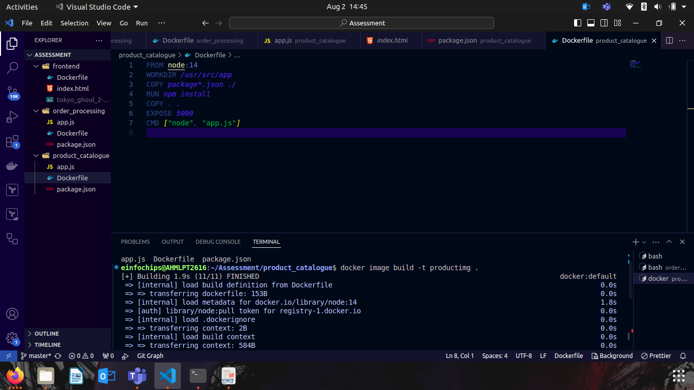
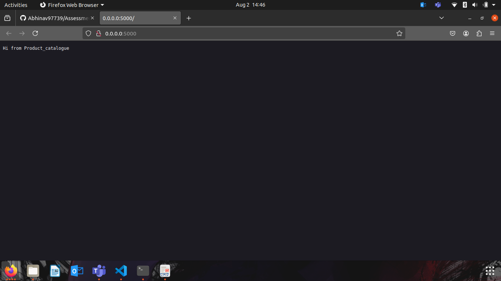
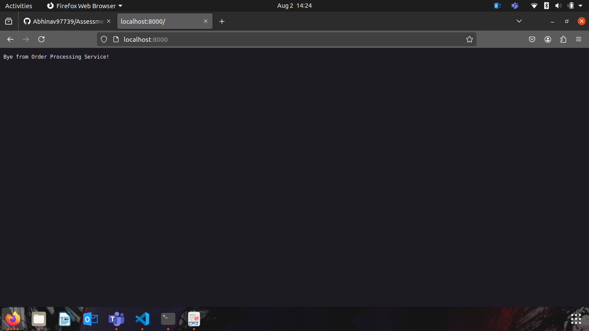
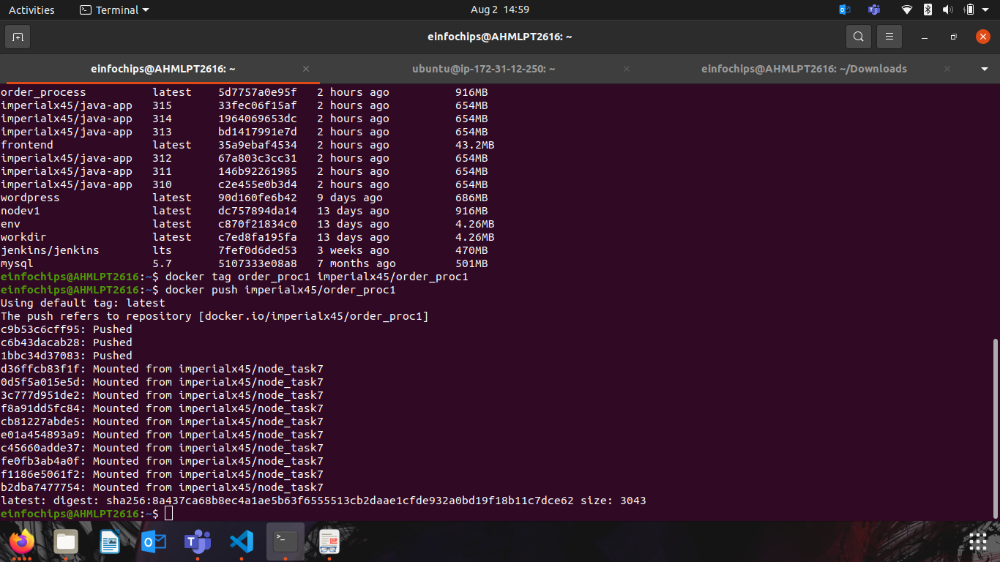
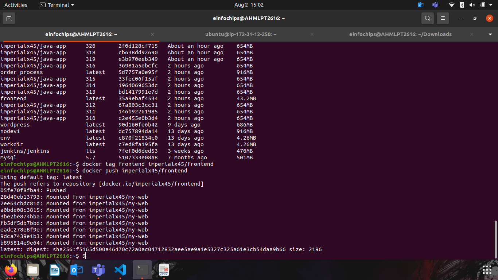
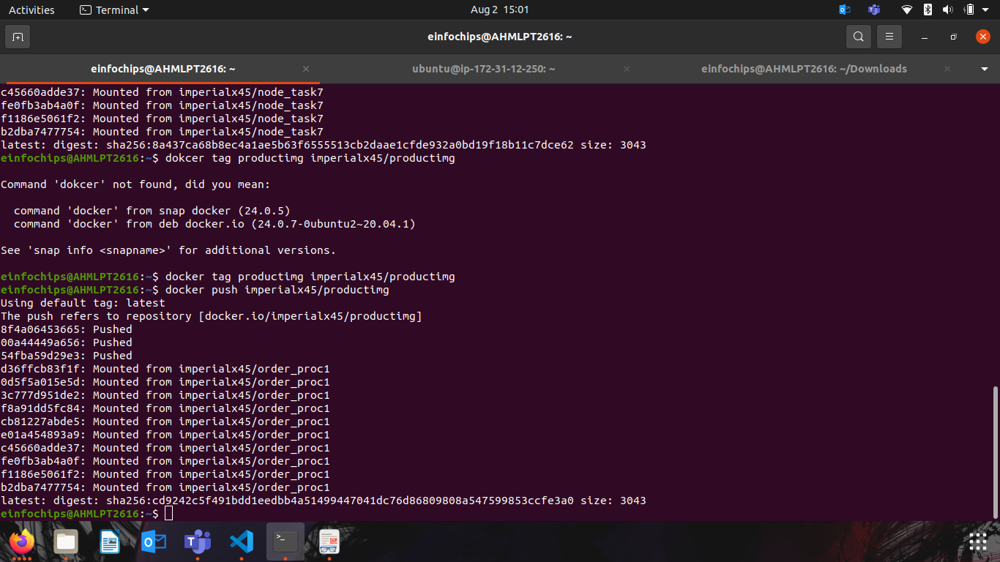
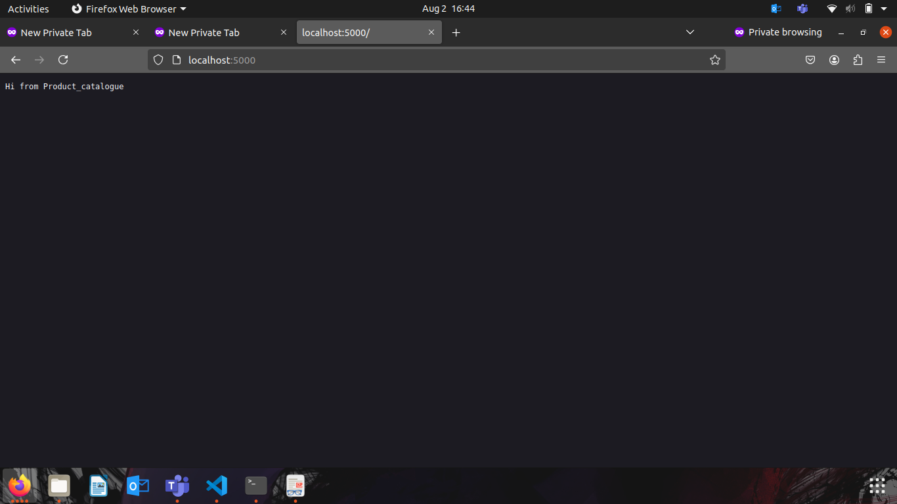
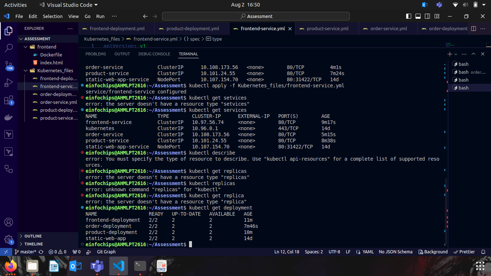
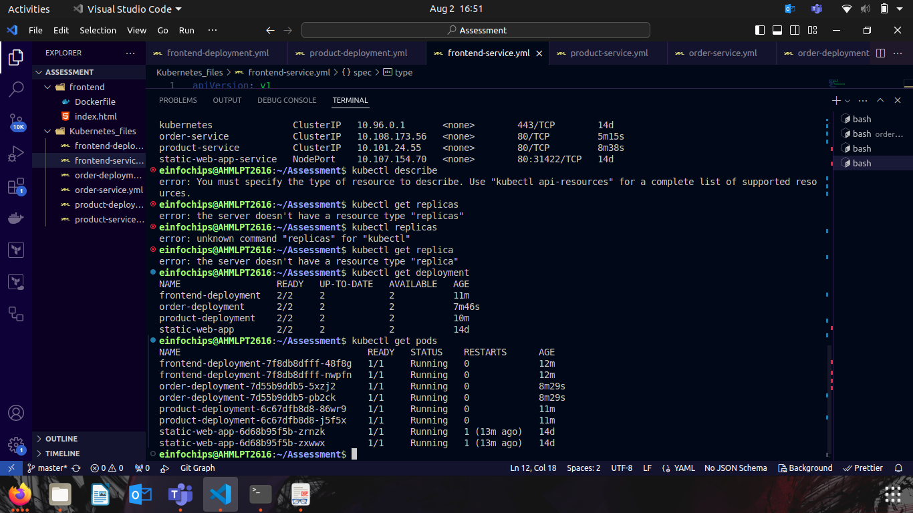

# Microservices Deployment Project

This project focuses on setting up a Git repository, Dockerizing microservices, and deploying them to a Kubernetes cluster. The project includes three main tasks: setting up a Git repository, Dockerizing microservices, and deploying them to Kubernetes.

## Table of Contents
- [Task 1: Git Repository Setup]
- [Task 2: Dockerize Microservices]
- [Task 3: Kubernetes Deployment]


## Task 1: Git Repository Setup

### 1. Create a Git Repository
Create a new Git repository to store all project files, including Ansible playbooks, Dockerfiles, and Kubernetes manifests.

```bash
git init
git add .
git commit -m "Initial commit"
git remote add origin <url of git>
git push -u origin main
```

```bash
git checkout -b develop
git push origin develop

git checkout -b test
git push origin test

# Merging changes
git checkout test
git merge develop
git push origin test

git checkout main
git merge test
git push origin main
```

### 1. Create Dockerfiles

Create Dockerfiles for each microservice (front-end, product catalog, order processing).
```Dockerfile
# Base image
FROM node:14

# Set working directory
WORKDIR /app

# Copy package.json and install dependencies
COPY package.json .
RUN npm install

# Copy source code
COPY . .

# Expose port and start the application
EXPOSE 3000
CMD ["npm", "start"]
```
.png>)


## Checking Whether are images are working using the container



## Similary created the Dockerfiles for Other mentioned parameters.

## Pushed the dockerimages to docker container registry




## Created the Kubernetes Manifests for the deployment and Services.
- Deploying the services and deployments file

.png>)

## Final Production 



